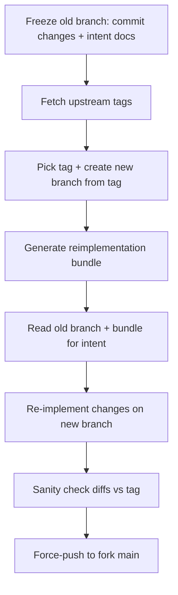

# Codex


This is strictly a personal hobby project, forked from [openai/codex](https://github.com/openai/codex).

## Quick Start

```shell
cd codex-rs
cargo run --bin codex
```

## Project Goals

We will never merge code from the upstream repo; instead, we re-implement our changes on top of the latest upstream code.

Iteration flow (aligned with `skills/codex-upstream-reapply`):



> [!IMPORTANT]
> **DO NOT USE IN PRODUCTION.**
> To keep upstream sync easy, we do not write test code for what we changed. This project is for experimental use only.

* **DX Focused:** Focus strictly on optimizing developer experience, **without adding new features**.
* **Upstream Sync:** We sync with the upstream repository regularly.

## What Changed

* Added a TUI status header with model/effort, cwd, git summary, and rate-limit status.
* Collaboration mode presets now accept per-mode overrides and default to the active `/model` settings.
* Full change log: see [CHANGED.md](./CHANGED.md).

## AGENT Local development check

1. DO NOT update any test codes
2. After making code changes, verify the CLI still launches:

```shell
cd ./codex-rs
cargo run --bin codex
```

```toml
# config.toml
[collaboration_modes.plan]
model = "gpt-5.2-codex"
reasoning_effort = "xhigh"

[collaboration_modes.code]
model = "gpt-5.2-codex"
```

## Skills

When syncing to the latest upstream codex version, use `skills/codex-upstream-reapply` to re-implement our custom requirements on top of the newest code, avoiding merge conflicts from the old branch history.

Usage: copy `skills/codex-upstream-reapply` into `~/.codex/skills`, for example:

```
~/.codex/skills/
└── codex-upstream-reapply/
    ├── SKILL.md
    ├── references/
    └── scripts/
```

Example:

```
$codex-upstream-reapply  update latest version
```

## Credits

Status bar design reference: <https://linux.do/t/topic/1481797>
