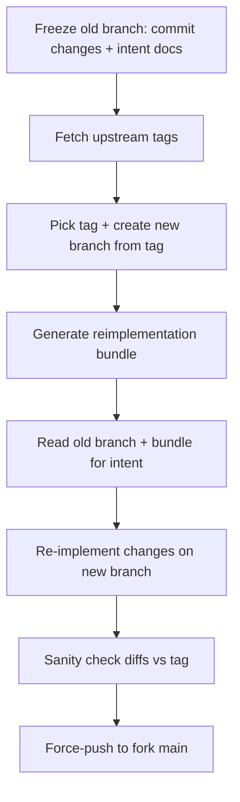

# Codext

An opinionated Codex CLI. This is strictly a personal hobby project, forked from openai/codex.

> 

## Quick Start

Choose one of these two ways:

* Install from npm:

```shell
npm i -g @loongphy/codext
```

* Build from source:

```shell
cd codex-rs
cargo run --bin codex
```

## Features


> Full change log: see [CHANGED.md](./CHANGED.md).

---

### TUI: Status Header
The TUI header now provides a comprehensive overview of your current workspace:
* **Context**: Displays the active model, effort level, and current working directory (`cwd`).
* **Git Status**: Real-time summary of your repository state.
* **Rate Limits**: Instant visibility into your API rate-limit status.
> 

### Copy to Clipboard

* **`Ctrl+Shift+C`**: Copies the current draft to the system clipboard.
* **`Ctrl+C`**: Retains existing behavior; remains backward-compatible with legacy logic when the draft is empty.

### Prompt Queueing on usage limit


Tab-queued follow-up messages are kept when usage limits are reached.

Codex pauses queued-message autosend while rate-limited, still allows Tab to add more queued messages, and automatically sends only the first queued user message once a later rate-limit snapshot shows quota is available again.

Remaining messages stay queued for normal FIFO draining.

### Automatic Account switch
TUI now monitors `auth.json` for external changes, automatically reloads authentication after external writes settle.

Fully compatible with [codex-auth](https://github.com/Loongphy/codex-auth) for seamless external login management.

### App-server Account Switching

The app-server reloads auth before `thread/start`, `thread/resume`, and `turn/start` when no turn is running, so Codex App can pick up a newly selected account at the next safe request boundary.

This supports Codex App account switching via [codex-auth#103](https://github.com/Loongphy/codex-auth/pull/103).

### Automatic Resumption
When the TUI detects an account switch after hitting a usage limit, it automatically dispatches a recovery prompt to resume the interrupted task.

You can configure this behavior using `[tui].usage_limit_resume_prompt`:
* **Custom Prompt**: Define a specific string to be sent as the "resumption turn." This prompt will be used to signal the model to continue where it left off.
* **Disable**: Set to `""` (empty string) to disable this automatic recovery behavior entirely.
* **Default**: If left unset, the system uses the following built-in prompt:
  ```text
  Please continue from where the conversation left off after the usage limit reset or account switch.
  ```
  Example:

  ```toml
  [tui]
  usage_limit_resume_prompt = ""
  ```

### AGENTS.md auto reload

AGENTS.md and project-doc instructions are refreshed on each new user turn, and Codex shows an explicit warning when a refresh is applied.

## Project Goals

We will never merge code from the upstream repo; instead, we re-implement our changes on top of the latest upstream code.

Iteration flow (aligned with `.agents/skills/codex-upstream-reapply`):


```mermaid
flowchart TD
    A[Freeze old branch: commit changes + intent docs] --> B[Fetch upstream tags]
    B --> C[Pick tag + create new branch from tag]
    C --> D[Generate reimplementation bundle]
    D --> E[Read old branch + bundle for intent]
    E --> F[Re-implement changes on new branch]
    F --> G[Sanity check diffs vs tag]
    G --> H[Force-push to fork main]
```

## Skills

When syncing to the latest upstream codex version, use `.agents/skills/codex-upstream-reapply` to re-implement our custom requirements on top of the newest code, avoiding merge conflicts from the old branch history.

Example:

```
$codex-upstream-reapply old_branch feat/rust-v0.94.0, new origin tag: rust-v0.98.0
```

## Credits

Status bar design reference: <https://linux.do/t/topic/1481797>
