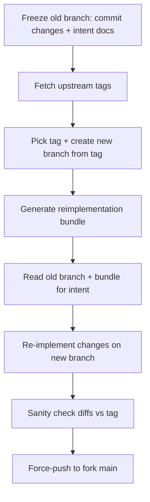

# Codext

An opinionated Codex CLI. This is strictly a personal hobby project, forked from openai/codex.


## Quick Start

Choose one of these two ways:

* Install from npm:

```shell
npm i -g @loongphy/codext
```

* Build from source:

```shell
cd codex-rs
cargo run --bin codex
```

## Features

> Full change log: see [CHANGED.md](./CHANGED.md).

* `Ctrl+Shift+C` in the TUI composer copies the current draft to the system clipboard; `Ctrl+C` keeps its existing behavior, and empty drafts still fall back to the old `Ctrl+C` path.
* TUI status header with model/effort, cwd, git summary, and rate-limit status.
* Collaboration mode presets accept per-mode overrides and default to the active `/model` settings. Example:

  ```toml
  # config.toml
  [collaboration_modes.plan]
  model = "gpt-5.4"
  reasoning_effort = "xhigh"

  [collaboration_modes.code]
  model = "gpt-5.4"
  ```

* TUI watches `auth.json` for external login changes and reloads auth automatically after writes settle. If a task is still running, the reload waits until the turn is idle, then refreshes rate limits and warns on account switch. When a turn stops on a usage limit, Codext queues a synthetic user turn ahead of other queued follow-ups and auto-dispatches it after the next auth reload that changes account identity; if a reload is already pending, that reload is applied first. This works well with [codex-auth](https://github.com/Loongphy/codex-auth) when you refresh or switch login state outside the TUI.
* The synthetic recovery turn text is configurable with `[tui].usage_limit_resume_prompt`. Leave it unset to use the built-in default, or set it to `""` to disable the automatic recovery turn entirely. The built-in default is:

  ```text
  The previous turn stopped because the active account hit a usage limit. Any pending auth reload has already been applied. Please continue the previous coding task from where it stopped, and use apply_patch for any required file edits.
  ```

  Example:

  ```toml
  [tui]
  usage_limit_resume_prompt = ""
  ```
* AGENTS.md and project-doc instructions are refreshed on each new user turn, and Codex shows an explicit warning when a refresh is applied.

## Project Goals

We will never merge code from the upstream repo; instead, we re-implement our changes on top of the latest upstream code.

Iteration flow (aligned with `.agents/skills/codex-upstream-reapply`):


```mermaid
flowchart TD
    A[Freeze old branch: commit changes + intent docs] --> B[Fetch upstream tags]
    B --> C[Pick tag + create new branch from tag]
    C --> D[Generate reimplementation bundle]
    D --> E[Read old branch + bundle for intent]
    E --> F[Re-implement changes on new branch]
    F --> G[Sanity check diffs vs tag]
    G --> H[Force-push to fork main]
```

## Skills

When syncing to the latest upstream codex version, use `.agents/skills/codex-upstream-reapply` to re-implement our custom requirements on top of the newest code, avoiding merge conflicts from the old branch history.

Example:

```
$codex-upstream-reapply old_branch feat/rust-v0.94.0, new origin tag: rust-v0.98.0
```

## Credits

Status bar design reference: <https://linux.do/t/topic/1481797>
